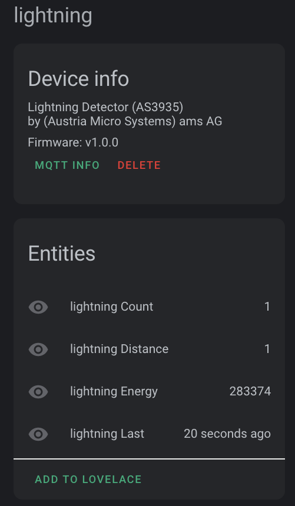

# lightning-detector-MQTT2HA-Daemon

[![GitHub Release][releases-shield]][releases]
[![GitHub Activity][commits-shield]][commits]

[![Project Maintenance][maintenance-shield]


A simple Linux python script to monitor the AS3935 Lightning Detector attach to the RPi on which it is running and report information from the detector via MQTT to your Home Assistant installation.

With this new sensor and a new Lovelace card you can monitor lightning presence in your local area.



This script can be configured to be run in **daemon mode** continously in the background as a systemd service.


## Features
* Tested on Raspberry Pi's 3 & 4 with Buster - but really should work on any.
* Tested with Home Assistant v0.111.0
* Tested with Mosquitto broker v5.1
* Data is published via MQTT
* QTT discovery messages are sent so the detector is automatically registered with Home Assistant (if MQTT discovery is enabled in your installation)
* MQTT authentication support
* Supports MQTT LWT so you can tell when the script is running
* No special/root privileges are required by this mechanism
* Linux daemon / systemd service, sd\_notify messages generated

### Lightning Detector Device
The AS3935 Lightning Detector monitored by this script is reported as:

| Name            | Description |
|-----------------|-------------|
| `Manufacturer`   | (Austria Micro Systems) ams AG |
| `Model`         | AS3935 |
| `Name`      | (fqdn) e.g., "pimon1.home" |
| `sofware ver`  | Script Version (e.g., v1.2.0) |
| `mac addr`       | mac: 00:00:00:00:00:00 |
| `IP addr`       | eth0: 00.00.00.00 -OR- wlan0: 00.00.00.00|


(The addreseses reported are those of the Raspberry Pi running this script.)

### Readings

This Lightning Detector as a sensor provides the following readings:

| Name            | Description |
|-----------------|-------------|
| `timestamp`   | date/time of report |
| `energy`         | engery for this report |
| `distance`      | distance to storm front |
| `count`      | # detections since last report |

(*from the datasheet*: If the received signal is classified as lightning, the energy is calculated. This value is just a pure number and has no physical meaning.)

## Prerequisites

An MQTT broker is needed as the counterpart for this daemon.

MQTT is huge help in connecting different parts of your smart home and setting up of a broker is quick and easy. In many cases you've already set one up when you installed Home Assistant.

## Installation

On a modern Linux system just a few steps are needed to get the daemon working.
The following example shows the installation under Debian/Raspbian below the `/opt` directory:

```shell
sudo apt install git python3 python3-pip

sudo git clone https://github.com/ironsheep/lightning-detector-MQTT2HA-Daemon /opt/ISP-lightning-mqtt-daemon

cd /opt/ISP-lightning-mqtt-daemon
sudo pip3 install -r requirements.txt
```
## Configuration

To match personal needs, all operational details can be configured by modifying entries within the file [`config.ini`](config.ini.dist).
The file needs to be created first:

```shell
cp /opt/ISP-lightning-mqtt-daemon/config.{ini.dist,ini}
vim /ISP-lightning-mqtt-daemon/config.ini
```

## Execution

A first test run is as easy as:

```shell
python3 /opt/ISP-lightning-mqtt-daemon/ISP-lightning-mqtt-daemon.py
```

Using the command line argument `--config`, a directory where to read the config.ini file from can be specified, e.g.

```shell
python3 /opt/ISP-lightning-mqtt-daemon/ISP-lightning-mqtt-daemon.py --config /opt/ISP-lightning-mqtt-daemon
```


### Run as Daemon / Service

You probably want to execute this script **continuously in the background**.
This can be done by running it as a daemon.

**NOTE:** Daemon mode must be enabled in the configuration file (default).

- via Systemd service - on systemd managed systems (the **recommended** option)

   ```shell
   sudo cp /opt/ISP-RPi-mqtt-daemon/template.service /etc/systemd/system/isp-lightning.service

   sudo systemctl daemon-reload

   sudo systemctl start isp-lightning.service
   sudo systemctl status isp-lightning.service

   sudo systemctl enable isp-lightning.service
   ```
   
## Integration

Detection values will be published to the (configurable) MQTT broker topic "`{base_topic}/{sensorName}/detect`" (e.g. `home/nodes/lightning01/detect`).

An example:

```json
{"timestamp": "2020-06-17T20:06:44-06:00", "energy": 303184, "distance": 1, "count": 1}
```

This data can then be subscribed to and processed by your home assistant installation.  

Additionally, the detector settings are written to: "`{base_topic}/{sensorName}/settings`" with the following fields:

```json
{"min_strikes": 5, "afe_inside": true, "disp_lco": false, "noise_floor": 1}
```

### Lovelace Card
Want to go further?  Shortly there will be a new *Lovelace card* specifically for visualizing lightning data. 

**--Coming Soon--**

## Credits
Thank you to "Hexalyse" for providing the starting logic for this effort. His project which i had tweeting (yes, in french) locally here in Colorado when i was first bringing up my hardware is [LightningTweeter](https://github.com/Hexalyse/LightningTweeter)

Thank you to also Thomas Dietrich for providing a wonderful pattern for this project. His project, which I use and heartily recommend, is [miflora-mqtt-deamon](https://github.com/ThomDietrich/miflora-mqtt-daemon)

----


## Disclaimer and Legal

> *Raspberry Pi* is registered trademark of *Raspberry Pi (Trading) Ltd.*
>
> This project is a community project not for commercial use.
> The authors will not be held responsible in the event of device failure or failure to detect any potentially damaging lightning.
>
> This project is in no way affiliated with, authorized, maintained, sponsored or endorsed by *Raspberry Pi (Trading) Ltd.* or any of its affiliates or subsidiaries.

----


### [Copyright](copyright) | [License](LICENSE)


[commits-shield]: https://img.shields.io/github/ironsheep/lightning-detector-MQTT2HA-Daemon.svg?style=for-the-badge
[commits]: https://github.com/ironsheep/lightning-detector-MQTT2HA-Daemon/commits/master
[license-shield]: https://img.shields.io/github/ironsheep/lightning-detector-MQTT2HA-Daemon.svg?style=for-the-badge
[maintenance-shield]: https://img.shields.io/badge/maintainer-S%20M%20Moraco%20%40ironsheepbiz-blue.svg?style=for-the-badge
[releases-shield]: https://img.shields.io/github/ironsheep/lightning-detector-MQTT2HA-Daemon.svg?style=for-the-badge
[releases]: https://github.com/ironsheep/lightning-detector-MQTT2HA-Daemon/releases
