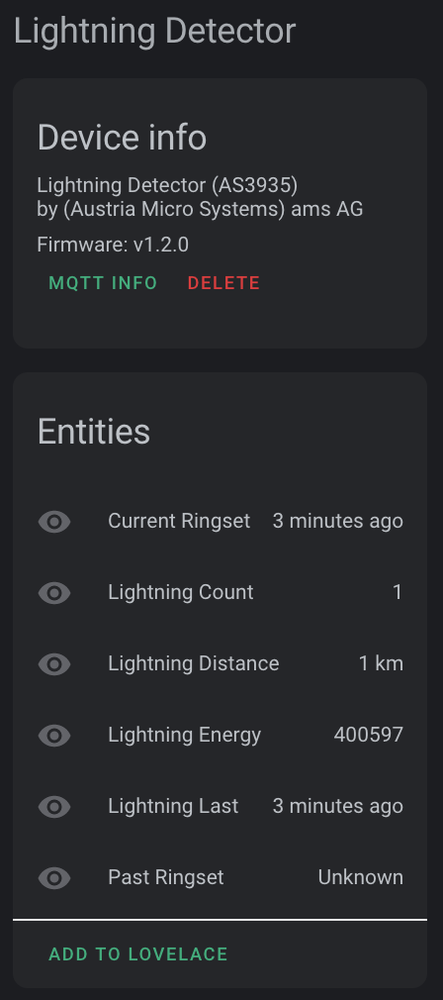

# lightning-detector-MQTT2HA-Daemon

![Project Maintenance][maintenance-shield]


A simple Linux python script to monitor the AS3935 Lightning Detector attached to the Raspberry Pi on which it is running and report information from the detector via MQTT to your Home Assistant installation.

With this new sensor and an upcoming new **Lovelace card** (links below) you can monitor lightning presence in your local area.

When this script/daemon is run it will broadcast discovery topics via MQTT decribing this new sensor to home assistant.  If you have MQTT Discovery enabled then this new sensor will appear as a new device in Home Assistant: (where the "Firmware: v...." will be the version number of this script that you've just set up.)



This script can be configured to be run in **daemon mode** continously in the background as a systemd service.

## Support

Hey dude! Help me out for a couple of :coffee:'s or :pizza: slices!

[](https://www.buymeacoffee.com/ironsheep)

## Features
* Tested on Raspberry Pi's 3 & 4 with Buster - but really should work on any.
* Tested with Home Assistant v0.111.0
* Tested with Mosquitto broker v5.1
* Data is published via MQTT
* QTT discovery messages are sent so the detector is automatically registered with Home Assistant (if MQTT discovery is enabled in your installation)
* MQTT authentication support
* Supports MQTT LWT so you can tell when the script is running
* No special/root privileges are required by this mechanism
* Linux daemon / systemd service, sd\_notify messages generated

### Lightning Detector Device
The AS3935 Lightning Detector monitored by this script is reported as:

| Name            | Description |
|-----------------|-------------|
| `Manufacturer`   | (Austria Micro Systems) ams AG |
| `Model`         | AS3935 |
| `Name`      | (fqdn) e.g., "mypi.home" |
| `sofware ver`  | Script Version (e.g., v1.0.0) |
| `mac addr`       | mac: 00:00:00:00:00:00 |
| `IP addr`       | eth0: 00.00.00.00 -OR- wlan0: 00.00.00.00|


(The addreseses reported are those of the Raspberry Pi running this script.)

### Readings

This Lightning Detector as a sensor provides the following readings:

| Name            | Description |
|-----------------|-------------|
| `timestamp`   | date/time of report |
| `energy`         | "energy" for this report * |
| `distance`      | distance to storm front |
| `count`      | # detections since last report |

\* (*from the datasheet*: If the received signal is classified as lightning, the energy is calculated. *This value is just a pure number and has no physical meaning*.)

## Prerequisites

### Detector Board
You'll need an inexpensive lightning detector sensor (based on the AS3925 integrated circuit.)  I picked up my [AS3925 integrated circuit on a small circuit board from Sparkfun](https://www.sparkfun.com/products/15441), but a [similar board also avail. from Amazon](https://www.amazon.com/Gravity-Lightning-Intensity-Thunderstorm-Photography/dp/B07N2M3L51?ref_=ast_sto_dp) 

**A NOTE of Caution!** Please watch your prices... you should be able to get one for under $30 USD*. People are trying to sell them at much higher prices. Shop around for your best price.

### MQTT Broker and Home Assistant

An MQTT broker is needed as the counterpart for this daemon.

MQTT is huge help in connecting different parts of your smart home and setting up of a broker is quick and easy. In many cases you've already set one up when you installed Home Assistant.  

You'll need to know the hostname (or IP address) of the machine where the MQTT broker is running as well as the port it is listening to. This is typically the default MQTT port (1883).  
*You will add this information to the config.ini for this script, as described below.*

## Connecting the AS3935 to your Raspberry Pi
You'll need the AS3935 Lightning sensor to be connected (via I2C for now) to your RPi.  Here's the pinout I use:

| AS3935 Pin      | Module Pin | Raspberry Pi Pin |
|-----------------|------------|------------------|
| 4 (GND)         | GND        | 9 (Ground) |
| 5 (VDD)         | VCC        | 1 (3.3v) |
| 10 (IRQ)        | IRQ        | 11 (GPIO 17) |
| 11 (I2CL)       | SCL        | 5 (SCL) |
| 13 (I2CD)       | SDA / MOSI | 3 (SDA) |

(You can use a different GPIO pin for the IRQ, but remember to change your config.ini:**intr_pin = 17** value to the GPIO # you choose.)
 
## Installation

On a modern Linux system just a few steps are needed to get the daemon working.
The following example shows the installation under Debian/Raspbian below the `/opt` directory:

```shell
sudo apt install git python3 python3-pip

sudo git clone https://github.com/ironsheep/lightning-detector-MQTT2HA-Daemon /opt/ISP-lightning-mqtt-daemon

cd /opt/ISP-lightning-mqtt-daemon
sudo pip3 install -r requirements.txt
```
## Configuration

To match personal needs, all operational details can be configured by modifying entries within the file [`config.ini`](config.ini.dist).
The file needs to be created first:

```shell
cp /opt/ISP-lightning-mqtt-daemon/config.{ini.dist,ini}
vim /ISP-lightning-mqtt-daemon/config.ini
```

## Execution

When you are ready to test your adjustments to the config.ini file you can start an MQTT monitor tool to see what your newly adjusted script will do. (I use [MQTTBox](http://workswithweb.com/mqttbox.html) to monitor all my MQTT testing.)

Once you are ready to monitor then a first test run is as easy as:

```shell
python3 /opt/ISP-lightning-mqtt-daemon/ISP-lightning-mqtt-daemon.py
```

Using the command line argument `--config`, a directory where to read the config.ini file from can be specified, e.g.

```shell
python3 /opt/ISP-lightning-mqtt-daemon/ISP-lightning-mqtt-daemon.py --config /opt/ISP-lightning-mqtt-daemon
```


### Run as Daemon / Service
----
>      ** CAUTION **
>   
>      Run as daemon is NOT YET working correctly. i'll be posting an update
>      as soon as I have the fix to this in place.  For now you can run from 
>      command-line which works but - as a daemon it is not yet starting.   
>
>         MORE SOON!
>       
>      ** CAUTION **

----

You probably want to execute this script **continuously in the background**.
This can be done by running it as a daemon.

**NOTE:** Daemon mode must be enabled in the configuration file (default).

- via Systemd service - on systemd managed systems (the **recommended** option)

   ```shell
   sudo ln -s /opt/ISP-RPi-mqtt-daemon/isp-lightning.service /etc/systemd/system/isp-lightning.service

   sudo systemctl daemon-reload

   sudo systemctl start isp-lightning.service
   sudo systemctl status isp-lightning.service

   sudo systemctl enable isp-lightning.service
   ```
   
   *NOTE: we use a symbolic link 'ln -s' so that when you list the files in /etc/systemd/system the link will point back to where your project in installed.  You'll see that many of your packages do this.*
   
## Integration

Detection values will be published to the (configurable) MQTT broker topic "`{base_topic}/{sensorName}/detect`" (e.g. `home/nodes/lightning01/detect`).

An example:

```json
{
  "last": "2020-06-19T17:26:22-06:00",
  "energy": 96098,
  "distance": 1,
  "count": 1
}
```

This data can then be subscribed to and processed by your home assistant installation.  

Additionally, the detector settings along with script settings are written to: "`{base_topic}/{sensorName}/settings`" with the following fields:

```json
{
  "settings": {
    "timestamp": "2020-07-10T12:52:07-06:00",
    "detector": {
      "min_strikes": 5,
      "afe_inside": true,
      "disp_lco": false,
      "noise_floor": 1
    },
    "script": {
      "period_in_minutes": 5,
      "end_storm_minutes": 30,
      "number_of_rings": 5,
      "distance_units": "km"
    }
  }
}
```

Lastly, there are two additional topics published which are used to drive our new **Lovelace card**. These are:

- "`{base_topic}/{sensorName}/crings`" - which posts the live status of current period, updated at each new strike
- "`{base_topic}/{sensorName}/prings`" - which posts the status of the preceeding full period, updated at the end of a period


## Lovelace Card for Home Assistant
Want to go further?  Shortly there will be a new [Lovelace Lightning Detector Card](https://github.com/ironsheep/lovelace-lightning-detector-card) specifically for visualizing lightning data. We are working on it now... Watch that project for further updates.


## Credits
Thank you to "Hexalyse" for providing the starting logic for this effort. His project which i had tweeting (yes, in french) locally here in Colorado when i was first bringing up my hardware is [LightningTweeter](https://github.com/Hexalyse/LightningTweeter)

Thank you to also Thomas Dietrich for providing a wonderful pattern for this project. His project, which I use and heartily recommend, is [miflora-mqtt-deamon](https://github.com/ThomDietrich/miflora-mqtt-daemon)


## Disclaimer and Legal

----
> *Raspberry Pi* is registered trademark of *Raspberry Pi (Trading) Ltd.*
>
> This project is a community project not for commercial use.
> The authors will not be held responsible in the event of device failure or failure to detect any potentially damaging lightning.
>
> This project is in no way affiliated with, authorized, maintained, sponsored or endorsed by *Raspberry Pi (Trading) Ltd.* or any of its affiliates or subsidiaries.

----

## License

Copyright © 2020 Iron Sheep Productions, LLC. All rights reserved.<br>
Licensed under the GPL 3 License.<br>
<br>
Follow these links for more information:

### [Copyright](copyright) | [License](LICENSE)


[commits-shield]: https://img.shields.io/github/commit-activity/y/ironsheep/lightning-detector-MQTT2HA-Daemon.svg?style=for-the-badge
[commits]: https://github.com/ironsheep/lightning-detector-MQTT2HA-Daemon/commits/master

[license-shield]: https://img.shields.io/github/license/ironsheep/lightning-detector-MQTT2HA-Daemon.svg?style=for-the-badge

[maintenance-shield]: https://img.shields.io/badge/maintainer-S%20M%20Moraco%20%40ironsheepbiz-blue.svg?style=for-the-badge

[releases-shield]: https://img.shields.io/github/release/ironsheep/lightning-detector-MQTT2HA-Daemon.svg?style=for-the-badge
[releases]: https://github.com/ironsheep/lightning-detector-MQTT2HA-Daemon/releases

