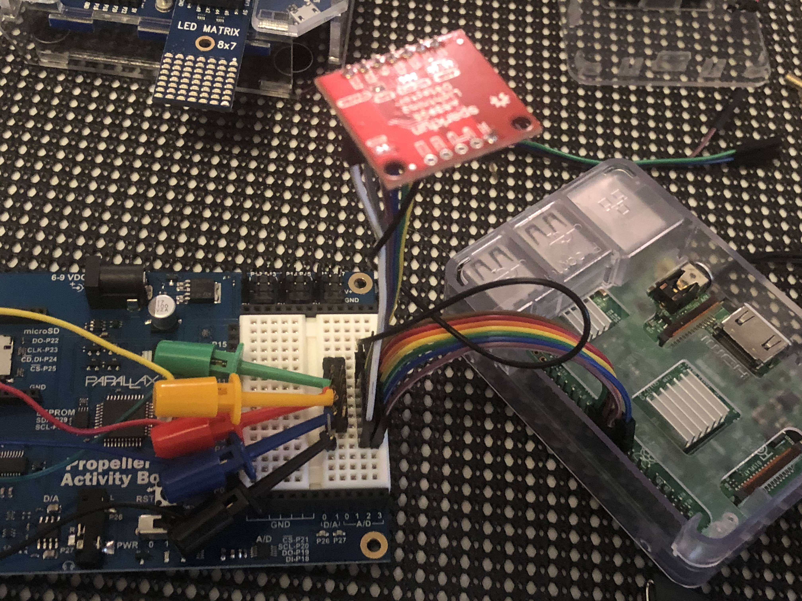
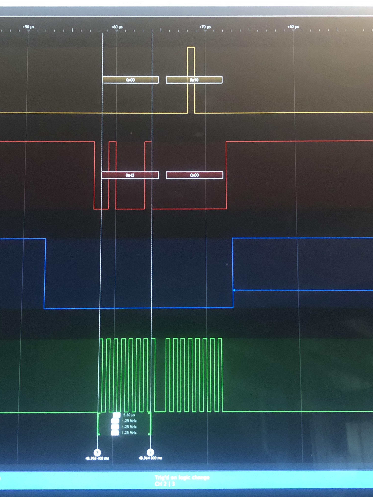
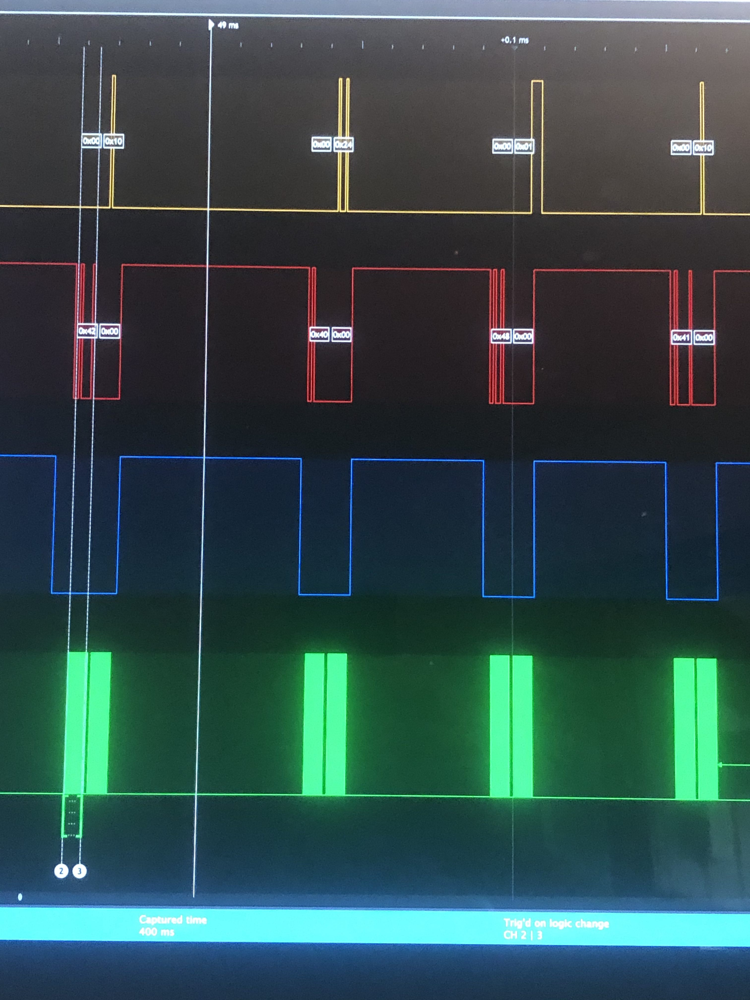

# Researching SPI support for AS3935
## lightning-detector-MQTT2HA-Daemon

![Project Maintenance][maintenance-shield]

This project supports both I2C and SPI forms of communication with the ASE935 Lightning Detector chip. While there is good Python library support for I2C, interacting with a SPI peripheral is more of a "roll-your-own" effort.  This is why I'm writing this "*here's what I needed do to interact with the AS3935 via SPI*" document.

I'll try to keep this short, presenting essential elements to understanding.

## Preparing to SPI

To interact iwth a SPI attached device you'll have to do some learning about the device itself.

You'll need to find out first about our AS3935:

| AS3935 SPI Questions |
| ---------------------|
| Maximum SPI Clock rate of the device
| Polarity of the SCLK signal
| Which edge [rising/falling] of the Clock the data is sampled
| Number of bits in the SPI word (8 for most of the devices)
| Style of Write transaction(s) the device wants/supports
| Style of Read transaction(s) the device wants/supports

...and then about about our RPi:

| Raspberry Pi (RPi) SPI Questions |
| ---------------------|
| Maximum SPI Clock rate of our RPi hardware
| How do we get to the SPI0 device on the RPi


I'll go into what we learned for each of this items in this Document. The last two of the AS3935 items are where you'll be deciding how you will need to use the underlying SPIDEV library to get reads/writes to work.

## Reading the AS3935 Datasheet with intent

The [AS3935 Datasheet](https://cdn.sparkfun.com/assets/learn_tutorials/9/2/1/AS3935_Datasheet_EN_v2.pdf) is where we find our SPI configuration specifics.  When you are starting work with a new device it is good practice to read through the datasheet for the device before you start.  This will give you an overall feel for how the device works and for what information you have at hand. You will often find suggestions for best practices to use when interacting with the device.  Ok, enough general info., let's get to finding what we need.

Since we are looking for how to configure our SPI bus let's go strait to the section entitled "**Serial Peripheral Interface (SPI)**" (*middle of Pg 20 in the PDF linked above.*)

The first thing we find is that our AS3935 Maximum clock freq. is 2Mhz. So we need to make sure we stay at 2Mhz or something lower.  *NOTE* also that there's a warning about frequencies around the 500kHz resonant frequency of our detector antenna so we should probably stay well above this frequency as well.

In the next section entitled "**SPI Command Structure**" we start learning about our commands. but as we are getting to that, we see something significant!

```
An SPI command consists of two bytes in series with the data being sampled on
the falling edge of SCLK (CPHA=1)
```

We then find out that this device supports two types of commands: Read and Write. This is pretty logical.  They also call out a specific form of write called a "Direct Write" which we'll learn more about later in this section.

The device registers are numbered from 0x00 to 0x3B.

The AS3935 SPI write can be seen in "**Figure 28: SPI Page Write**" (*bottom of Pg 22 in the PDF linked above.*)  We see here that this is a simple consecutive write of N bytes with the first byte specifying the starting address to be written with subsequent bytes being written to the start+0, start+1, start+2, ... locations.

Next, we see the AS3935 SPI read in "**Figure 29: SPI Read Byte**" (*middle of Pg 23 in the PDF linked above.*)  Here we see that we are to write a byte and then read a byte which shows up immediately after our write.  This is where our spidev documentation kind of breaks down as we are trying to learn how to code this. But we'll address how to handle this shortly.

Lastly, in the next section entitled "**Send Direct Command Byte**" (*still on page 23*) we meet the aforementioned "Direct Write" command. Really all this amounts to is that we are writing a special fixed value to one of two specific registers to cause special device functions to occur. This will fold into our earlier write command without really doing anything special. Noted.

Well, we've reached the end of the SPI section of our datasheet so let's fill in what we know:

Here's our updated list so far:

| AS3935 SPI Questions |  What we've Learned |
| ---------------------|---------------------|
| Maximum SPI Clock rate of the device | 2MHz
| -> Special note: We should avoid 500kHz  | 500KHz < (our SCLK value) < 2MHz
| Polarity of the SCLK signal | not given, use default: (CPOL=0)
| Which edge [rising/falling] of the Clock the data is sampled| Falling edge: (CPHA=1)
| Number of bits in the SPI word  | not given, use default: 8-bits
| Style of Write transaction(s) the device wants/supports | write {value(s)} starting at {address}
| Style of Read transaction(s) the device wants/supports | read {value(s)} starting from {address}

Let's move on to studying the RPi.


## Researching our Host (the RPi)

Now we need to learn about the SPI subsytem of the RPi. For this let's refer to the [SPI section](https://www.raspberrypi.org/documentation/hardware/raspberrypi/spi/README.md) of the Official Doumentation.  By reading this page we learn that SPI is not enabled by default and the preferred way to enable it is to run `sudo raspi-config` and enable the SPI hardware. We then see that once enabled, our SPI device will show up as `/dev/spidev0.0`.

In the section entitled "**Hardware**" we learn that the Standard Master mode is enabled by default. Good, this is what we'll need.

Then, further down we find the section entitled "**Chip Select** but this appears to be for a DMA mode so doesn't appear to help us. We know our device requires that CS be driven low, but we've no info in the docs that inform us, so far.

So let's move to the section below here entitled "**Speed**" *(this is the 2nd of two sections with this title!).*

Here is where we find what we are looking for. The maximum speed supported by the driver is 125.0 MHz!

Let's review what we've learned about our RPi:

| Raspberry Pi (RPi) SPI Questions |  What we've Learned |
| ---------------------|---------------------|
| Maximum SPI Clock rate of our RPi hardware | 125.0 MHz (*well above our chip limit of 2MHz*)
| How do we get to the SPI0 device on the RPi | SPI0 is found at `/dev/spidev0.0`

This completes our hardware fact-finding, now we need to figure out how we'll need to interact with the spidev API.

## Interpreting our need vs. the spidev API

The spidev python library interface info is found as [spidev - PyPl](https://pypi.org/project/spidev/)   We seems to offer a lot of setup specifics but we need to figure out reads and writes!

Spidev reads and writes are:

| spidev method |  Description |
| ---------------------|---------------------|
| readbytes(n) |   Read n bytes from SPI device. |
| writebytes(list of values)  |  Writes a list of values to SPI device.  |
|  writebytes2(list of values)  |  Similar to writebytes but accepts arbitrary large lists   |
|  xfer(list of values [, speed_hz, delay_usec, bits_per_word])  |   Performs an SPI transaction. Chip-select should be released and reactivated between blocks. Delay specifies the delay in usec between blocks.  |
|  xfer2(list of values [, speed_hz, delay_usec, bits_per_word])  |  Performs an SPI transaction. Chip-select should be held active between blocks.   |
|  xfer3(list of values [, speed_hz, delay_usec, bits_per_word])  |  Similar to xfer2 but accepts arbitrary large lists.   |

Geez, oddly enough we are missing a key piece of data on this page.  So i had to do more research.  New search term "**spidev documents**" - and i ran accross this seemingly platform specific doc. [SpiDev Documentation](https://www.sigmdel.ca/michel/ha/rpi/dnld/draft_spidev_doc.pdf) that had the clue I needed.  I found that the xfer(), xfer2() and xfer3() methods have a return value!

And there's one more fact to remember with SPI devices. The master provides the clock so the slave device can complete its work!  This means that for our AS3935 which provides bytes after we send the address from which to read that we must supply clocks for each of the bits of the data bytes so the slave can write the values for the master to read! To state this another way we need to send pad bytes (we don't care about their value) within the xfer-write so that the slave can return the desired values!

So, now writing read/write is going to be fairly easy, well... sortof:

| method need |  in terms of spidev API |
| ---------------------|---------------------|
| write {value(s)} starting at {address} | writebytes([address, value]) |
| read {value(s)} starting from {address} | bytesRead = xfer(address, {place-holder-bytes})

Ok this is our plan. But what does it all look like in python?


## What we've learned - realized as spidev API calls

I'll pull exerpts from the underlying class objects this project uses.

Here's the configuration code I use:

```python
   from AS3935.AS3935_i2c_spi import AS3935_SPI

    # note: spi_device=0, spi_bus=0 matching /dev/spidev0.0

    detector = AS3935_SPI(interrupt_pin, spi_device, spi_bus)
    detector.max_speed_hz(1250000)  # 1,250,000 Hz (1.25 MHz)
    detector.mode(0b01)     # [CPOL=0|CPHA=1] per AS3935 doc.
```

In this example you see the selection of spi device and bus matching so the code selects the SPI0 device. You see me selecting 1.25Mhz as the SCLK which is > 500KHz and < our 2MHz upper limit.  You also see CPOL set to 0 and CPHA set to 1.

...looking deeper into `AS3935.AS3935_i2c_spi`, we see the underlying class constructor method:

```python
    def __init__(self, irq, bus=0, device=0x00):
        """
        Configure the main parameters of AS3935.

        :param irq: (int) GPIO pin number the IRQ is connected at (BCM number)
        :param bus: (int, optional) the bus the AS3935 is connected at. Default = 0
        :param device: (int, optional) the device number of the AS3935 spi device file. Default = 0x00
        """
        self.device = device
        self.bus = bus
        self.irq = irq
        self.pi = pigpio.pi()
        self.bitsPerWord = 8
        # configure spidev device
        self.spi_device = spidev.SpiDev()
        self.spi_device.open(bus, device)
        self.spi_device.lsbfirst = False
```

...followed by configuration methods:

```python
    def max_speed_hz(self, speedInHz):
        """
        Configures the SPI clock frequency

        :param speedInHz: (int) desired SCLK freq. in Hz
        """
        self.speedInHz = speedInHz
        # configure spidev device
        self.spi_device.max_speed_hz = speedInHz
```

```python
    def mode(self, modeBits):
        """
        Configures SPI signal polarities

        :param modeBits: (int) SPI mode as two bit pattern of clock polarity and phase [CPOL|CPHA], min: 0b00 = 0, max: 0b11 = 3
        """
        self.spi_mode = modeBits
        # configure spidev device
        self.spi_device.mode = modeBits
```


Next, let's look into `AS3935.AS3935_i2c_spi` implementation of the reads and write:

```python

    def read_bytes(self, address, count=1):
        """
        Returns the byte values read from starting address.

        :param address: (int) the address to read from (between 0x00 and 0x3F)
        :param count: (int) the number of bytes to be read (between 0x00 and 0x3F)
        :return: (list) byte values read the address (values between 0x00 and 0xFF)
        """
        if not 0 <= address <= 63:
            raise ValueError("The address must be between 0x00 and 0x3F")
        read_cmd = [ address & 0x3f | self.BITS_A7A6_READ ] + [ 0x0 ] * count
        bytesRead = self.spi_device.xfer(read_cmd)
        if not len(bytesRead) == count + 1:
            raise AssertionError('Failed to read {} byte(s) from SPI device (got {})!'.format(count, len(bytesRead)))
        bytesRequested = bytesRead[1:]
        if not len(bytesRequested) == count:
            raise AssertionError('Failed to read {} byte(s) from SPI device (got {})!'.format(count, len(bytesRequested)))
        return bytesRequested
```

This is our many value read. (we mostly do single value reads until we need to read the detection strength then we read values from 3 consectutive registers. (*read starting at for length of 3*)

Next, we have a simplifying method for single byte reads:

```python
    def read_byte(self, address):
        """
        Returns the value of the byte read from address.

        :param address: (int) the address to read from (between 0x00 and 0x3F)
        :return: (int) byte value read from the address (value between 0x00 and 0xFF)
        """
        # a simple alias of our base read so code reads better
        bytesRead = self.read_bytes(address, 1)
        if not len(bytesRead) > 0:
            raise AssertionError('At least 1 byte should have been returned from SPI device!')
        return bytesRead[0]
```

I added this simply because there are so many times we want to just read 1 byte from an address so pulling the single-byte value from the list in one place just made sense.

Lastly here's our write:

```python
    def write_byte(self, address, value):
        """
        Writes value at address.

        :param address: (int) the address to write to (between 0x00 and 0x3F)
        :param value: (int) the byte value (between 0x00 and 0xFF)
        """
        if not 0 <= address <= 63:
            raise ValueError("The address must be between 0x00 and 0x3F")
        if not 0 <= value <= 255:
            raise ValueError("The value must be between 0x00 and 0xFF")

        write_cmd = [ address & 0x3f | self.BITS_A7A6_WRITE, value ]
        self.spi_device.writebytes(write_cmd)
```

Most of our writes are single byte writes so this is all we needed to implement.

## Sometimes you just have to try

I tried to show how and where I found the facts to guide our implementation. We found a good bit!  But there were just some things we couldn't figure out in advance.

**Clock Polarity** wasn't specified so I played with 1 and 0 and the 0 value worked!  It was pretty telling. With the wrong SCLK polarity the device didn't respond. With correct polarity it responded.  We call this a light-bulb test!

**Control of /CS lines** wasn't identified in the RPi docs. So I wired it up and verified the behavior with a Logic Analyzer and it just worked. (See Blue CS trace in Analyzer screen shots below.) I'll call it a good day any day I don't have to research further how something has to be controlled!

## Measured Results - The Proof

When writing code to drive hardware you have to measure the signals passed between the devices to verify their communication.  Here's my test setup:



The colored probes you see (above) are connected to my [SQ200 from ikalogic.com](https://www.ikalogic.com/sq-logic-analyzer-pattern-generator/) an inexpensive ~$175 Logic Analyzer / Pattern Generator. It comes with ScanaStudio software which automatically decodes most protocols I use in my play/work efforts.  (*Yes, it even decodes the SPI protocol!*)

Here is the picture I took of the scanstudio screen recording the proof of our SPI clock setup, polarities and showing that the AS3935 actually responding!



This image shows our write to register 2 along with a pad byte of 0x00 so that we can read the response from the AS3935.

Now lets look at a few more transactions:



Here we see:

* a read of Register 0x02 - AS3925 answers with 0x10
* a read of Register 0x00 - AS3925 answers with 0x24
* a read of Register 0x08 - AS3925 answers with 0x01
* a read of Register 0x01 - AS3925 answers with 0x10

**Exercise for the reader**: review the register map in the AS3935 datasheet to see what registers were being read and what the returned values mean!


Ok, that's all I have for this document. I hope what I have written here has helped you to understand a little more about how to research SPI for a specific device and then how to write code to interact with that device.

---

*If you have any questions about what I've written here, file an issue and I'll respond with edits to this doc to attempt to make things more clear.*

Thanks for Reading, following along.

```
Stephen M. Moraco
Lead developer
Iron Sheep Productions, LLC.
```

If you find this kind of written explanation useful, helpful I would be honored by your helping me out for a couple of :coffee:'s or :pizza: slices!

[](https://www.buymeacoffee.com/ironsheep)

---

Last Updated: 02 Sep 2020, 02:26 MST

[maintenance-shield]: https://img.shields.io/badge/maintainer-S%20M%20Moraco%20%40ironsheepbiz-blue.svg?style=for-the-badge
