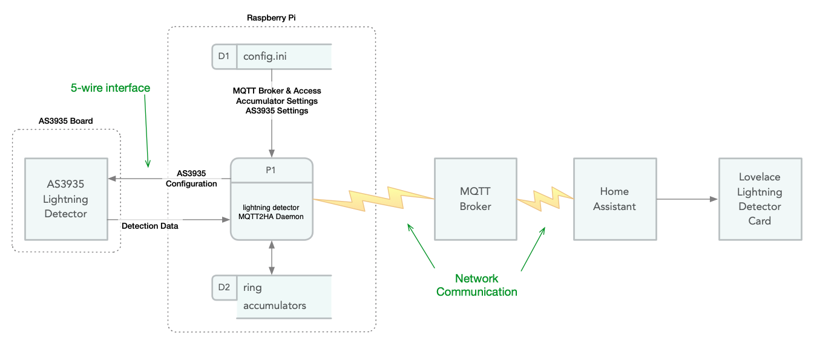

# Theory of Operations:
## lightning-detector-MQTT2HA-Daemon

![Project Maintenance][maintenance-shield]

The ISP-lightning-mqtt-daemon.py script starts up by:

* Loading the set up inforamtion from the config.ini (D1)
* Setting up communication with the MQTT Broker
* Sends LWT details to the MQTT Broker
* Sends the Home Assistant MQTT Discovery information to the Broker
* Configures a keep-alive timer so it knows when to tell the broker it's still running
* Configures the AS3935 Detector

Lastly, it sits, forever, waiting for interrupts from the detector. Here's a rough diagram of our system:



Let's start by understanding a tiny bit about our dectector. (*All the way to the left of our diagram.*)

-
### The AS3935

This sensor, in simple terms, listens for detections and then reports them as each is heard. It reports only a **relative strength** of the detection and **an estimate of distance** to the detection.

**NOTE: there is NO directional information privided by the AS3935 sensor.**

-
### How we get to "Rings"

Since we don't have direction for a given detection, we only know that it happend say 12km away from us. This could be any direction from our position which is why we think in terms of rings. 

This detector reports distances as one of 16 possible values: overhead, >40km away, or any of 14 possible distances between the two and these are not quite evenly spaced apart.

16 bands (rings) would be hard to show on a card and equally hard would be showing the dissimilar ring widths for each, so we decided that a user configurable number of equal-width rings would be shown on our **lovelace lightning detector card**.  In the **config.ini** you'll find:

```
[Behavior]
number_of_rings = { 3-7, Default: 5 }
```
-
### A "Moving window"

We also made a simplifying assumption that the most useful information to see would be, say, the most recent period of detections. So as each detection is "heard", we "remember" it. We also then "forget" any detections older than this period and we forward this new remaining set of detections via the MQTT broker to our card.  Here's the setting for this window size as seen in our **config.ini**:

```
[Behavior]
period_in_minutes = { 2-10, Default: 5 }
```

-
### What about the whole storm?

Yes we think the duration of the whole storm is also something useful to see on our card. The beginning of the storm is easy, this is the date/time of our first detection after we haven't seen a storm for a while.

The end of the storm is a little softer, however.  So we added another user-configurable setting to our **config.ini**:

```
[Behavior]
end_storm_after_minutes = { 10-60, Default: 30 }
```

This script then has a timer to locate the end of the storm which we start setting when we first have a full period of no detections. Then if a detection is heard we stop the timer and start waiting for nothing again. Eventually we'll reach the end of storm timeout and we'll report that the "storm ended" to our card.

-
### Detection Accumulation

Now let's look at what we do with each the detections: How do we determine storage based on user configured rings? How do we store a detection in a ring? and lastly how do we report this to our card?

Our Ring Accumulator (D2 in our diagram, above) is setup at runtime once we know how many rings we have. Then we runtime-configure a lookup table for which of the 16 distances reported by the AS3935 gets put into which ring.

Finally as each detection happens, we get the current time and we save the detection distance, power and timestamp into the bucket for the ring indicated by the distance.  We then scan to see if there are any old detections and remove them from any bucket they are in and lastly we send all the detection data to the card via MQTT.  Here's what that JSON payload looks like:

```json
{
	"crings": {
		"timestamp": "2020-07-18T14:23:30-06:00",
		"last": "2020-07-18T14:23:30-06:00",
		"first": "2020-07-18T14:23:30-06:00",
		"storm_last": "2020-07-18T14:23:30-06:00",
		"storm_first": "2020-07-18T14:23:30-06:00",
		"end_minutes": 30,
		"period_minutes": 5,
		"units": "km",
		"out_of_range": 1,
		"ring_count": 5,
		"ring_width_km": 7,
		"ring0": {
			"count": 0,
			"distance_km": 0,
			"from_units": 0,
			"to_units": 4.9,
			"energy": 0
		},
		"ring1": {
			"count": 0,
			"distance_km": 5,
			"from_units": 5,
			"to_units": 11.9,
			"energy": 0
		},
		"ring2": {
			"count": 0,
			"distance_km": 12,
			"from_units": 12,
			"to_units": 18.9,
			"energy": 0
		},
		"ring3": {
			"count": 0,
			"distance_km": 19,
			"from_units": 19,
			"to_units": 25.9,
			"energy": 0
		},
		"ring4": {
			"count": 0,
			"distance_km": 26,
			"from_units": 26,
			"to_units": 32.9,
			"energy": 0
		},
		"ring5": {
			"count": 0,
			"distance_km": 33,
			"from_units": 33,
			"to_units": 40,
			"energy": 0
		}
	}
}
```

What are we looing at here? It's all pretty easy. For the entire ring-set we have:

| key            | meaning |
|----------------|-------------|
| `timestamp`   | time when this ring-set was sent |
| `last`         | most recent detection in this ring-set |
| `first`      | oldest detection in this ring-set|
| `storm_last`      | most recent detection of this storm |
| `storm_first`      | first detection of this storm |
| `end_minutes`      | user configured no-detection period which will end the storm |
| `period_minutes`      | user configured period |
| `units`      | are we showing distances in 'km' or 'mi' (miles) |
| `out_of_range`      | # detections in this period that are beyond 40km |
| `ring_count`      | user configured number of rings to display |
| `ring_width_km`      | calculated rough width in km of each ring |

Then for each ring we have:

| key            | meaning |
|----------------|-------------|
| `count`   | the number of strikes in this ring |
| `distance_km`         | inner edge of ring distance (ignored by card) |
| `from_units `      | distance of inner edge of ring (used in card label) |
| `to_units `      | distance of outer edge of ring: (used in card label) |
| `energy `      | average value of strikes in this ring (or did I use median value? hmmm...) |

Notice that we are feeding value to the card so it doesn't have to calculate them?  Yes, this is by design simply to reduce the possibilty of the two this script and the card getting out of sync with each other.

-
### Current ring-set and Past ring-set

You just saw that that payload has a wrapping key called `crings`. This stands for **current ring set**. There is also the **past ring set** or `prings` reported at the and of each period.  This is simply a snapshot of the crings state at the end of the 5 minute period.  This is provided in case there is some interest in the ending display of the prior period of strikes for this storm. Just add a 2nd lightning detector card to your view and set the entity to the `prings` sensor and now you see both sets of rings with the new one only updating at the end of each period! These are each sent on their own MQTT Topic so let's go over what topics are maintained by this script.

-
### Topics

This script posts data at various times to the following topics:

| Name            | Description |
|-----------------|-------------|
| `{base_topic}/{sensorName}/detect` | details of the latest detection |
| `{base_topic}/{sensorName}/settings` | detector settings along with script settings |
| `{base_topic}/{sensorName}/crings` | live status of the current period |
| `{base_topic}/{sensorName}/prings` | status of the preceeding full period, updated at the end of each period. |

Please refer to the [README](README.md) for the json payload examples for `~/detect` and `~/settings` topics.

**NOTE:** the Lovelace lightning detector card only listens to one of `crings` or `prings` the other two topics are not used by the card.  The `~/settings` topic is provided so one can easily go to `configuration -> devices -> lightning detector` and tap on the `~settings` sensor to see the currently configured settings values, all within Home Assistant.

---

# Wait, there's a storm generator in here?

Why yes, there is. When building this card I needed to replay a storm over, and over, and over... to get the coloring to look right to get the storm-end detection to work right, etc.

In order to do this I need data that looked reasonable so i created parameterized storm generator.  Create a storm .ini file with values you want, run the generator script and viola! you now have a randomized list of storm detections you can feed to this script!

Refer to the [TEST](./TEST) folder in this Repo. where the script, example storm configurations and the generated files live.

OK, but why did I mention this?  Because in the next section you'll be wanting to feed your own data to this script to be reported to the card and that is exacly what the test subsytem of this .py script does. There is a pattern here you'll be able to use.


#  Thoughts about adaptation to your own detector
## (or network feed, or ...)

It would be pretty easy to disable the AS3935 detector parts of this code and enable your own code that provides detections to the accumulating and reporting parts of this script.  In essence you replace the front-end source of data with your own and this script will then take care of getting your data to the card in the correct format.

For each detection you'd want to specify **a relative power value** to take advantage of the card ring coloring and you'd wnat to identify **the distance of the detection** as well.  You'll also want to filter your detection distances so that they stay within the 40km limit of this mechanism oh, and lastly, you'll want to add a one-liner lookup to convert your distance to one of the legal sensor values since this script validates that! But again, don't worry, all of this is already shown working in the testing side of this script. The test mechanism had to do all of these same things.

Lastly, feed your "detections" to the interrupt handler as if it were test data and you are good to go.

-

*If you have any questions about what I've written here, file an issue and I'll respond with edits to this doc to attempt to make things more clear.*

Thanks for Reading, following along. I look forward to seeing what adaptations you come up with. Please let me know when you do!

```
Stephen M. Moraco
Lead developer
Iron Sheep Productions, LLC.
```

-

Last Updated: 02 Aug 2020, 02:02 MST

[maintenance-shield]: https://img.shields.io/badge/maintainer-S%20M%20Moraco%20%40ironsheepbiz-blue.svg?style=for-the-badge
